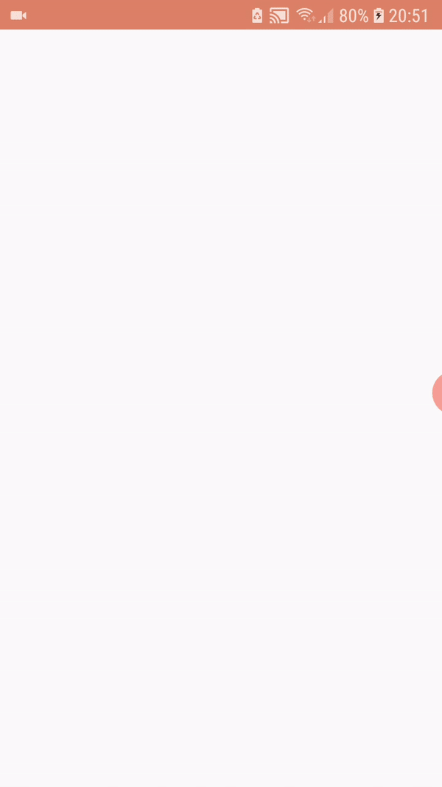

# Social Network for Mars Rovers :rocket:

A sample project created with Nasa API (by Chris Cerami) that shows photos taken on Mars by the rovers: Curiosity, Opportunity and Spirit

### Project idea

The idea was born while I was asking myself "what if Nasa Rovers had a Social Network?" :shipit:

### User Journey

When the app starts we have a brief introduction with a fragment

in the next fragment we can click on the label "Date" and choose a date and see the photos that the corresponding Rover took on the Date that we selected

also if we click on the Rover's name we can see a preview of his story/mission

### :books: Libraries I used 
###### Animation
- Lottie
- Glide
- SwipeRefreshLayout
###### Layout
- ViewPager2
- RecyclerView
- TabLayout
###### Server call
- Retrofit2
- Coroutines
- Jackson

